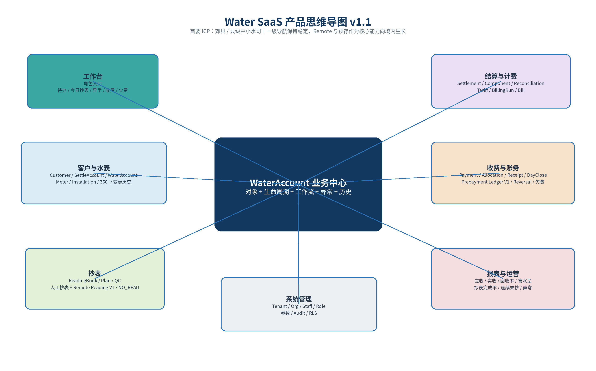
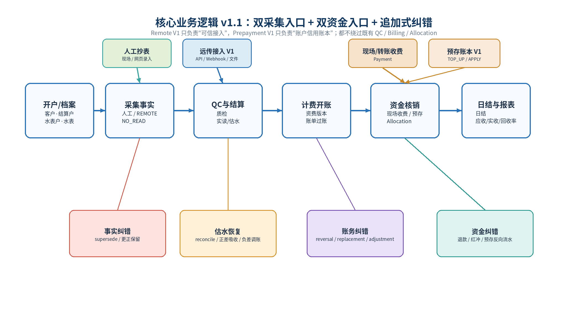
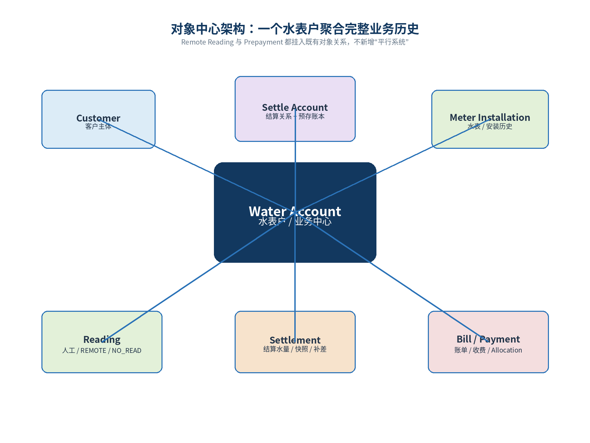
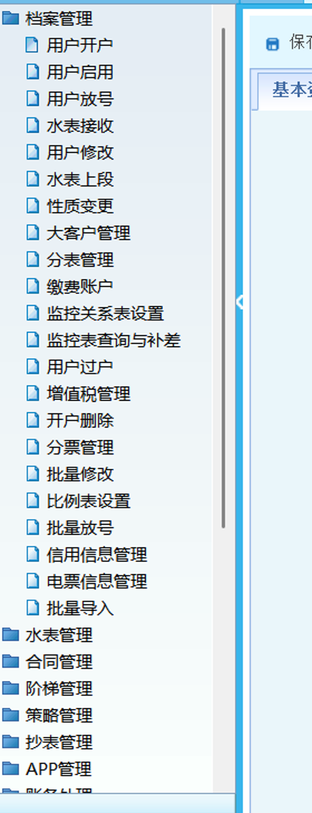
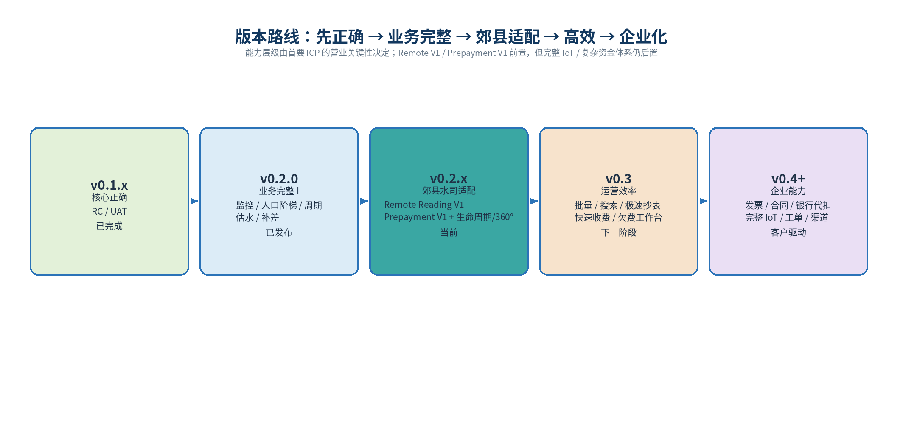

# Water SaaS — 产品地图与架构规划

> **Canonical Source**: 本文件是唯一可编辑的产品基线。产品决策先更新本文件 → Product Gate → Epic Spec → 开发。`docs/product-map/` 下的 Word 文档是阶段性发布快照，不反过来成为主要编辑源。

| 字段 | 值 |
|---|---|
| Product Map Version | v1.1 |
| Product Baseline | v0.2.0-mvp（业务完整性版本已通过 Release Gate） |
| Primary ICP | 郊县/县级中小水司及区域供水单位 |
| Current Stage | v0.2.x County Utility Fit + 真实 Pilot |
| Date | 2026-09-21 |

**文档定位**：这是产品决策基线，不是功能堆叠清单。任何新增功能都应先映射到业务域、核心对象、用户问题、版本层级和明确的"不做什么"。

**核心方向**：郊县水司优先 + 少而稳定的业务域 + 对象中心 + 可追溯账务 + Remote / Prepayment 能力前置

## 阅读结论

**一句话产品定义**：面向郊县/县级中小水司及区域供水单位的现代化营业收费 SaaS：以客户与水表为对象中心，贯通人工/远传采集、结算计费、现场/预存资金核销、日结与运营分析；先保证账务正确，再补郊县关键能力，再优化效率，最后扩展企业集成。

我们不复制成熟老系统的几十个菜单。成熟系统的价值在于证明"长期运营最终会遇到哪些业务问题"；我们的目标是用更清晰的数据模型和对象中心交互，把这些能力压缩进少量稳定业务域。

| 主题 | 冻结结论 |
|---|---|
| 产品骨架 | 7 个一级业务域：工作台、客户与水表、抄表、结算与计费、收费与账务、报表与运营、系统管理 |
| 业务中心 | WaterAccount（水表户）是主要业务聚合点，串联客户、结算关系、水表安装、抄表、结算、账单、收费和历史 |
| 账务原则 | POSTED 财务事实不可原地改；更正通过 supersede / reversal / replacement / adjustment，保留完整历史 |
| 版本策略 | v0.2.0=业务完整 I；v0.2.x=郊县水司适配；v0.3=高效使用；v0.4+=企业能力；GIS/APP/DMA 等客户驱动 |
| 当前重点 | Remote Reading Integration V1、Prepayment V1、水表生命周期 UI、用户360°、异常中心、欠费/运营报表 |

## 目录

1. 产品思维导图与七大业务域
2. 产品定位与设计原则
3. 业务架构与核心交易主链
4. 对象模型：WaterAccount 360°
5. 功能层级：Core / Operational / Enterprise / Specialized
6. 当前基线与成熟系统启示
7. v0.2 家族产品地图：v0.2.0 + 郊县水司适配
8. v0.3：运营效率
9. v0.4+：企业能力与客户特化
10. 角色与信息架构
11. 技术与数据架构护栏
12. 版本治理与验收门禁
13. 下一步执行计划

---

## 1. 产品思维导图与七大业务域



*图 1  Water SaaS 产品思维导图：一级业务域保持稳定，能力向内生长而不是向菜单扩散*

## 2. 产品定位与设计原则

### 2.1 产品定位

Water SaaS 的目标不是成为一个"功能最多"的传统营业收费系统，而是成为一个可快速部署、账务正确、流程清晰、可持续扩展的水务营业收费 SaaS。v1.1 将首要 ICP 明确为郊县/县级中小型自来水公司及区域供水单位；园区、机场、物业供水单位仍属于相邻市场。首要 ICP 的现实特征——人工与远传表长期混用、欠费与回收率压力较高、IT 团队较轻——直接决定 Remote Reading Integration V1 与 Prepayment V1 的优先级。

### 2.1.1 首要 ICP：郊县 / 县级中小水司

| ICP 特征 | 常见现实 | 产品含义 | 近期优先级 |
|---|---|---|---|
| 表计结构 | 机械表与远传表长期并存 | 保留人工抄表主链，同时建设轻量 Remote 数据接入层 | Remote Reading V1 |
| 收费回收 | 欠费/回收率压力高，居民预存可改善现金回收 | 预存必须进入账务闭环、收据、日结和自动抵扣 | Prepayment V1 |
| 组织能力 | 人员精简、专职 IT 能力有限 | 配置简单、失败可回退、不要先做重型 IoT/工作流平台 | SaaS 简化运维 |
| 采购决策 | 先看能否稳定营业，再看高级集成 | Core 层级由目标客户营业关键性决定，不是行业绝对分类 | 先核心、后企业化 |

### 2.2 五条产品原则

| 原则 | 解释 |
|---|---|
| 对象中心，而不是菜单中心 | 围绕 WaterAccount、Meter、Settlement、Bill、Payment 等对象组织操作和历史；避免"开户/修改/查询/删除/换表"分别变成一级菜单 |
| 事实与计算分离 | 真实表码是事实；估水、结算水量、补差和费用是派生结果。禁止用"模拟表码"污染原始事实 |
| 财务不可变 | 终审/过账后的业务事实不原地修改；错误通过追加式纠正，完整保留审计链 |
| 先正确，再完整，再高效 | v0.1.x 建立正确闭环；v0.2.0 完成第一阶段业务完整；v0.2.x 补郊县关键能力（Remote/预存）；v0.3 优化日常效率；企业集成后置 |
| 少而稳定的一级导航 | 一级域尽量维持 7 个。新能力优先进入既有域，除非形成新的独立业务责任边界 |

## 3. 业务架构与核心交易主链

### 3.1 七大业务域

| 业务域 | 责任 | 主要能力 | 定位 |
|---|---|---|---|
| 工作台 | 角色入口 | 今日待办、抄表进度、异常、收费、欠费、开账失败 | v0.2/V0.3逐步增强 |
| 客户与水表 | 基础档案与生命周期 | Customer、SettleAccount、WaterAccount、Meter、Installation、变更历史 | 核心 |
| 抄表 | 采集与质检 | 抄表册、计划、人工实抄、Remote Reading V1、未抄见、QC、估水入口 | 核心 |
| 结算与计费 | 水量到应收 | Settlement、Component、Reconciliation、Tariff、BillingRun、Bill | 核心 |
| 收费与账务 | 应收到实收 | 欠费、Payment、Allocation、Receipt、Prepayment Ledger V1、Reversal、DayClose | 核心 |
| 报表与运营 | 运营可见性 | 应收、实收、回收率、售水量、抄表完成率、异常、连续未抄 | 核心→增强 |
| 系统管理 | 组织与安全 | Tenant、Org、Staff、Role、参数、审计 | 平台底座 |

### 3.2 核心业务链



*图 2  核心交易主链与异常纠错轨道*

**关键判断**：真正复杂的不是 Happy Path，而是"业务已经发生以后如何纠错"。因此换表、补抄、估水恢复、补差、红冲、重开等能力必须保持追加事实与可追溯历史。

### 3.3 关键业务状态与不可变边界

| 对象 | 典型状态 | 冻结规则 |
|---|---|---|
| 抄表 | PENDING → PASSED / REJECTED / MANUAL_REVIEW | 更正用 supersede，新行成为有效事实，旧行保留 |
| 结算 | DRAFT → FINAL | FINAL 不原地改；后续差异通过 reconciliation/adjustment |
| 资费 | DRAFT → ACTIVE → RETIRED | 已用于账单的版本冻结；新价格开新版本 |
| 账单 | DRAFT → POSTED / PARTIAL_PAID / PAID | POSTED 之后不改金额；通过 reversal/replacement 纠正 |
| 收款 | RECEIVED → DAY_CLOSED（或红冲追加负向收款） | 日结历史保持不变，跨日红冲进入下一次日结 |
| 水表安装 | ACTIVE → REMOVED | 拆表/换表产生新的安装事实；已终审期间禁止回写造成漏量 |

## 4. 对象模型：WaterAccount 360°

成熟系统通常把同一个水表户拆成"开户、修改、过户、换表、查询、欠费、收费"等多个菜单。我们的目标是让 WaterAccount 成为主要业务上下文：用户只需先找到"这个户"，再查看和处理完整生命周期。



*图 3  WaterAccount 360° 对象关系*

### 4.1 建议的 360° 页面

**页面头部**：张三 · A2026000123 · 居民计量 · 正常 ｜ 当前欠费 ¥126.30 ｜ 当前表 M000231 ｜ 本期状态：已抄/待结算

| Tab / 区块 | 内容 | 主要操作 |
|---|---|---|
| 概览 | 当前状态、最近读数、欠费、本期进度、异常提示 | 收费、抄表、换表、更多操作 |
| 水表 | 当前水表、安装历史、换表/拆表记录 | 换表、拆表、故障处理 |
| 抄表 | 历史读数、NO_READ、QC、估水来源 | 补录、更正、查看异常 |
| 结算 | 本期/历史 Settlement、Component、估水/补差来源 | 查看终审、补差解释 |
| 账单 | 应收、红冲/重开、资费版本、金额解释 | 查看账单、进入收费 |
| 收费 | 支付、分摊、收据、红冲 | 收款、打印、追溯 |
| 变更历史 | 过户、人口、类别、安装、状态变更 | 只读审计 |

## 5. 功能层级：四层产品地图

所有能力按"是否属于核心交易闭环、是否主要提升效率、是否属于企业集成、是否高度客户特化"分层。这样可以防止成熟系统的长期功能一次性侵入 MVP。

| 层级 | 版本 | 判断标准 | 能力范围 |
|---|---|---|---|
| L1 Core Transaction | v0.2.x | 业务必须能跑，并适配首要 ICP | 客户/水表、人工/Remote抄表、QC、估水、结算/补差、人口阶梯、开账、收费、预存V1、红冲、日结、欠费、基础报表 |
| L2 Operational Efficiency | v0.3 | 一天能高效处理几百户 | 全局搜索、用户360° V2、异常排序、批量抄表/QC/结算、极速收费、Excel 导入导出、欠费工作台 |
| L3 Enterprise Operation | v0.4+ | 进入正式水司运营体系 | 电子发票、合同、银行代扣/第三方支付、催缴、停复水、工单、短信通知、完整远传设备管理与财务对账 |
| L4 Specialized | 客户驱动 | 有明确客户/合同再做 | GIS、DMA/产销差、重点贸易表、APP/微信营业厅、信用系统、复杂优惠和集团财务 |

## 6. 当前基线与成熟系统启示

### 6.1 v0.2.0 已建立的产品底座

| 能力 | 状态 | 说明 |
|---|---|---|
| 客户/结算户/水表户 | 已完成 | 三账户关系与立户闭环 |
| 水表与安装 | 数据模型完成 | Meter 与 MeterInstallation 分离；UI 生命周期仍需增强 |
| 抄表册/计划/录入/QC | 已完成 + v0.2.0增强 | ACTUAL/REMOTE/NO_READ；MONTHLY/BIMONTHLY；更正保留历史 |
| 结算/估水 | 已完成 + v0.2.0增强 | Settlement/Component；AVG3；NO_READ estimateQty；估水来源与恢复补差 |
| 资费/计费 | 已完成 + v0.2.0增强 | 资费版本、阶梯、BillingRun、Bill；effective-dated 人口 + Settlement 快照 |
| 收费/收据/日结 | 已完成 | 部分能力已通过浏览器 UAT 主链验证 |
| 报表 | 基础版 | 抄表日报、收费日报、应收、实收、回收率 |
| 权限与审计 | 已完成底座 | Tenant/RLS/Org/Role/Audit |

### 6.2 成熟系统给我们的三类信号

- **必须学习的**：完整业务覆盖、异常场景、历史纠错、抄表生产、人口阶梯、换表/拆表、欠费/收费、报表口径。
- **不能照搬的**：围绕菜单组织业务；同一对象被拆成开户/修改/查询/换表/收费等大量入口；页面字段堆叠；查询模块重复业务菜单。
- **应当优化的**：对象中心 360°、角色工作台、异常中心、批量与键盘效率、明确状态与来源解释、统一搜索。



*图 4  成熟系统菜单示例：业务覆盖完整，但功能高度碎片化（用户提供截图）*

### 6.3 核心保留 / MVP 暂缓 / 优化重构

| 类别 | 内容 |
|---|---|
| 核心必须保留 | 客户/水表户/结算户、水表安装、人工/Remote抄表、抄表册/计划/QC、NO_READ/估水、结算/补差、阶梯、开账、欠费、收费、预存V1、红冲、日结、基础报表、权限审计 |
| MVP 暂缓 | 合同归档、发票库存/电子发票、银行代扣、复杂催缴、停复水工单、APP、GIS、信用、复杂优惠、报表设计器、完整 IoT 设备管理平台 |
| 优先优化 | Remote Reading V1、Prepayment V1、用户360°、异常中心、水表生命周期、欠费工作台、全局搜索、批量操作、统一业务解释 |

## 7. v0.2 家族产品地图：v0.2.0 + 郊县水司适配

**v0.2 家族目标**：v0.2.0 已完成第一阶段"业务完整性"：监控表、人口阶梯、双月抄表、NO_READ估水与恢复补差。v0.2.x 不扩企业重功能，转向首要 ICP 的 County Utility Fit：把远传读数接入、预存水费、水表生命周期、360°、异常与欠费运营补齐。

| Epic | 阶段 | 业务规则 / 范围 | UI 交付 |
|---|---|---|---|
| E1 用水类别与监控表 | v0.2.0 已发布 | 固定五类；MONITORING 系统客户；不可计费 DB invariant；仍可正常抄表/结算 | 受控类别 + 监控表完整向导/展示 |
| E2 居民人数与阶梯 | v0.2.0 已发布 | effective-dated household profile；Settlement 快照；baseHousehold/perPersonQty；YTD 年度累计 | 账单解释本期人数、基准人数、增加额度 |
| E3 抄表周期 | v0.2.0 已发布 | MONTHLY/BIMONTHLY；anchorPeriod；后端 due；非应抄期 warning 但允许补抄 | 册设置 + 生成计划提示 |
| E4 未抄见估水与恢复 | v0.2.0 已发布 | NO_READ estimateQty；人工覆盖 > reader estimate > AVG3；正差吸收/负差 adjustment；历史重计价 | 来源清晰，不制造模拟表码；补差文案业务化 |
| E5 Remote Reading Integration V1 | v0.2.x 近期优先 | 厂商 Adapter + API/Webhook/文件；设备标识绑定；原始事件幂等留痕；生成 REMOTE reading；异常进入 QC；失败可回退人工 | 远传来源/采集时间/状态可见；绑定与失败诊断；不做重型设备平台 |
| E6 Prepayment V1 | v0.2.x 近期优先 | 以 SettleAccount 为账户；append-only ledger：TOP_UP/APPLY/REFUND/REVERSAL；余额派生；账单过账后按规则抵扣；进入收据/日结 | 预存余额、充值、退款/红冲、流水、自动抵扣解释 |
| E7 水表生命周期 UI | v0.2.x | 装表、换表、拆表、故障/停用、安装历史；FINAL 期间 fail-closed | 聚合到 WaterAccount 详情，不新增多个一级菜单 |
| E8 用户 360° V1 | v0.2.x | 概览、水表、抄表、结算、账单、收费/预存、变更历史 | 形成对象中心工作入口 |
| E9 异常中心 V1 | v0.2.x | 未抄见、连续估水、异常高/低水量、QC 待复核、开账失败、远传采集失败 | 聚合与跳转处理，不做复杂工作流引擎 |
| E10 基础运营报表增强 | v0.2.x | 欠费表、售水量、抄表完成率、连续未抄、异常水量、预存余额/抵扣摘要 | 固定高价值报表 + 导出；不做报表设计器 |

### 7.1 v0.2.x 仍明确不做

- 电子发票与发票库存
- 合同管理与归档
- 完整 IoT 设备管理平台（协议栈 / 固件 / 指令下发）
- 银行代扣与第三方支付渠道
- 复杂催缴 / 停复水 / 工单工作流
- 移动 APP / GIS / DMA / 重点贸易表
- 通用报表设计器
- 复杂预存财务清算 / 跨主体资金池

### 7.2 E5 Remote Reading Integration V1 — 冻结决策

> 冻结时间：2026-09-21。厂商 Adapter 待定——先冻结接入框架与领域模型，不虚构第一家厂商接口。详见 `product-map/E5_REMOTE_READING_V1.md`。

**数据链路**：

```
外部数据源
  ├─ Vendor API Pull
  ├─ Webhook Push
  └─ CSV/Excel Import
          ↓
   Remote Adapter
          ↓
Raw Remote Event（append-only）
          ↓
   设备/水表绑定
          ↓
MeterReading(resultType=REMOTE)
          ↓
        QC
          ↓
    Settlement
```

第一版开发实现 **FileImportAdapter** 作为参考 Adapter 与 Pilot fallback——对郊县水司本身也有实际价值。拿到真实厂商 API 文档后再增加 `VendorXAdapter`，领域层不改。

**冻结规则**：

- Adapter 绝不能直接写 Settlement/Bill；
- 所有远传数据必须先形成 Raw Event，再进入 MeterReading；
- Raw Event 的 identity 与 raw payload 不可变；处理状态可演进，但每次变化/重放必须留审计；
- 幂等模型：Adapter 输出 `externalEventKey`，唯一约束 `(tenantId, remoteSourceId, externalEventKey)`；厂商有稳定事件 ID 直接用，没有则对规范化字段做 deterministic fingerprint；
- 设备绑定 effective-dated（`effectiveFrom/effectiveTo`）：事件按 `collectedAt` 归属当时有效的安装段，厂商补传历史数据不落新表；
- 设备未绑定水表时进入"待绑定/异常"，不能猜；
- 晚到 REMOTE 撞上已 QC PASSED 的人工实抄 → 进入 CONFLICT，复核员裁决后才产生更正读数，账务不自动变化；
- 异常读数仍走 QC；
- 远传失败后允许人工补抄；
- V1 不做协议栈、集中器、固件升级、远程阀控、设备运维平台。

### 7.3 E6 Prepayment V1 — 冻结决策

> 冻结时间：2026-09-21。默认**自动抵扣**——预存的目的就是提高回收率，收费员手工点"使用预存"会降低价值。详见 `product-map/E6_PREPAYMENT_V1.md`。

**资金链路**：

```
客户支付 → 先按账龄顺序清现有欠费（Allocation）→ 余款 +TOP_UP → 可用余额

Bill POSTED → 自动检查预存余额 → 按冻结排序 Allocation → 全额/部分抵扣
```

示例：欠费 80，客户交 200 → 清欠 80（Allocation），余款 120 记 TOP_UP；新账单 POSTED 130 → 自动抵扣 120，账单剩 10，余额 0，状态 PARTIAL_PAID。**复用现有 Allocation，不另造第二套销账逻辑。**

**抵扣排序冻结**：`period ASC → postedAt ASC → id ASC`；未来引入 dueDate 后升级为 `dueDate ASC → postedAt ASC → id ASC`。

**现金口径冻结**：TOP_UP=现金实收；APPLY=内部销账（非现金，不二次计入实收）；REFUND=现金流出；REVERSAL 按被冲事实反向。DayClose/报表必须分列现金收款、预存充值、退款/冲正、预存抵扣（非现金信息项）。

**红冲联动冻结**：账单 reversal/replacement 时，其上预存 APPLY 追加反向 ledger 恢复余额，原 APPLY 不修改；混合支付按现金/预存各自来源分别逆转。

**资金归属冻结**：WaterAccount 改挂结算户时预存余额不自动迁移；有余额时 UI 必须警告；跨结算户转移（TRANSFER_OUT/IN）不属于 V1。

**权限矩阵**：

| 操作 | 权限 |
|---|---|
| 预存充值（含先清欠） | 收费员（`payment:write`） |
| 查看余额/流水 | 收费员、营业员、管理员（`payment:read`） |
| 系统自动抵扣 | SYSTEM |
| 当日未日结错误充值冲正 | 原收费员（`payment:write` + 同日/本人约束） |
| 已日结冲正 / 客户退款 | 管理员/主管（新增 `prepayment:reverse`） |
| 删除流水 | 永远禁止 |

`REFUND` 与 `REVERSAL` 都必须新增负向 Ledger 事实，绝不修改余额字段或删除原充值。

**余额定义**：`balance = Σ effective ledger entries`。数据库可缓存余额做性能优化，但缓存不能成为唯一真相。

## 8. v0.3：运营效率（从"能用"到"好用"）

v0.3 不以新增复杂业务规则为主，而是在 v0.2.x 完成郊县关键营业能力后回答一个更现实的问题：收费员、抄表员、复核员每天处理几百户时，系统是否足够快、足够直觉。

| 能力 | 目标 |
|---|---|
| 全局搜索 | 户号/客户号/姓名/手机号/地址/表号/支付单号统一入口，直接落到 360° |
| 极速抄表 | 连续录入、键盘优先、上一户/下一户、上期表码与异常阈值同时可见 |
| 批量 QC | 异常排序、批量通过/复核、历史均量与变化率 |
| 批量结算/开账 | 按账期、组织、册批量处理；失败户单独形成可恢复队列 |
| 快速收费台 | 搜索即定位、欠费一眼可见、默认分摊、收款后自动进入下一户 |
| Excel 导入导出 | 开户、人口、抄表、欠费等明确模板；错误行报告 |
| 欠费工作台 | 按账龄/金额/区域/类别排序，支持批量导出与后续催缴 |
| 运营工作台 | 抄表完成率、异常、欠费、收费、未日结、开账失败等角色化 KPI |

## 9. v0.4+：企业能力与客户特化

| 方向 | 能力 |
|---|---|
| 财务/票据 | 电子发票、发票红冲、银行代扣、第三方支付、复杂预存清算/资金池、正式财务对账 |
| 客户运营 | 催缴、短信/微信通知、停复水、工单、合同 |
| 设备与采集 | 完整远传设备管理平台：协议/集中器/指令下发/固件/设备健康；V1 数据接入不在此层 |
| 专业水务 | DMA/产销差、重点贸易表、GIS、漏损与监测 |
| 渠道 | 移动 APP、微信营业厅、自助查询缴费 |
| 大型组织 | 多级集团权限、复杂审批、跨组织财务与数据交换 |

**进入规则**：L3/L4 能力只有在"明确客户 + 明确业务流程 + 明确数据接口 + 明确验收口径"时进入实施，不因成熟系统存在就默认加入 Roadmap。



*图 5  版本路线图*

## 10. 角色与信息架构

| 角色 | 默认入口 | 主要目标 |
|---|---|---|
| 管理员/营业员 | 客户与水表、资费、结算、开账、综合查询 | 业务设置与综合处理 |
| 抄表员 | 工作台、抄表册/计划、人工录入、NO_READ、远传异常 | 最快完成现场/网页录入 |
| 复核员 | 异常中心、抄表记录、QC、结算预览 | 只看值得看的异常，提高审核效率 |
| 收费员 | 收费台、预存、收据、收费记录、日结 | 20–30 秒完成普通缴费；预存充值/抵扣可解释且可追溯 |
| 管理人员 | 工作台、报表、欠费、异常、回收率 | 回答"今天发生了什么、哪里有风险" |

### 10.1 一级导航冻结建议

| 一级导航 | 包含内容 |
|---|---|
| 工作台 | 所有角色可见但内容不同 |
| 客户与水表 | 客户、结算户、水表户、水表、360° |
| 抄表 | 抄表册、计划、人工录入/QC、Remote 接入状态、异常入口 |
| 结算与计费 | 结算、补差、资费、开账、账单 |
| 收费与账务 | 收费台、预存、收费记录、日结、红冲/欠费 |
| 报表与运营 | 固定报表、运营指标、异常与欠费分析 |
| 系统管理 | 组织、员工、角色、参数、审计 |

### 10.2 不再新增"重复查询模块"

查询能力优先进入对象详情和全局搜索。例如 Customer/WaterAccount 详情直接展示抄表、结算、账单、收费和变更历史；不再分别建立"客户查询、客户历史查询、抄表查询、费用查询"的重复菜单。

## 11. 技术与数据架构护栏

产品地图决定"做什么"，技术护栏决定"无论增加什么功能都不能破坏什么"。当前模块化单体 + PostgreSQL + RLS 是适合 MVP/早期 SaaS 的架构，不需要为了 Roadmap 提前拆微服务。

| 护栏 | 当前原则 | 对未来功能的要求 |
|---|---|---|
| Tenant / RLS | 共享 PostgreSQL，tenant_id + RLS；运行角色 non-owner / no BYPASSRLS；FORCE RLS | 任何新表默认进入租户隔离设计 |
| 业务事实 | Reading 等采集事实 append-only；更正用 supersede | 不允许用估水伪造 register reading |
| 结算快照 | Settlement 保存影响历史定价/补差的快照，例如 householdSizeSnapshot | 历史重算不读取可变的"当前值" |
| 财务不可变 | POSTED Bill / Payment 历史不原地修；用 reversal/replacement/adjustment | 对账可重演、审计可解释 |
| 金额与数量 | 数量 Decimal；金额整数分；统一 HALF_UP | 避免浮点误差 |
| 幂等 | 立户、计划、结算、计费、收款等关键写操作提供幂等 | UI 双击/重试不得重复写业务单 |
| 版本 | 资费版本、业务状态、审计日志 | 规则变化必须可追溯到当期版本 |
| 远传接入 | 原始采集事件 append-only + source/vendor/device key + 幂等 | Adapter 不得绕过 MeterReading/QC；失败可回退人工；V1 不承担设备协议栈 |
| 预存账本 | 以 SettleAccount 为账户；余额由不可变 ledger 汇总 | 禁止 mutable balance 作为唯一真相；充值/抵扣/退款/红冲都追加流水并进入审计/日结 |

### 11.1 人口阶梯与估水的冻结逻辑

**人口阶梯**：人数必须 effective-dated；Settlement 生成时快照当期人数。历史补差/重算使用快照而不是 WaterAccount 当前人数。阶梯扩展只平移多档 PER_QTY 的有限边界，YTD 年度累计逻辑保持不变。

**估水优先级**：显式 Settlement 人工覆盖 > NO_READ 上的抄表员 estimateQty > AUTO_AVG3；来源必须可追溯。模拟读数只允许前端展示，不落库为真实表码。

### 11.2 Remote Reading 与 Prepayment 的冻结逻辑

**Remote Reading V1**：只解决"远传数据可信进入现有抄表主链"：外部平台 → Adapter → 原始采集事件 → Meter 绑定 → REMOTE Reading → QC → Settlement。原始事件 identity/payload 不可变、按 externalEventKey 幂等、绑定按 collectedAt 取有效时段；晚到数据与已确认人工实抄冲突时进入 CONFLICT 人工裁决；不把厂商协议栈、固件、指令下发和完整设备运维平台提前到 V1。

**Prepayment V1**：以 SettleAccount 为账户，使用 append-only ledger（TOP_UP / APPLY / REFUND / REVERSAL）；余额是流水汇总结果而不是可随意改写字段。客户资金先清现有欠费、余款才形成余额；账单 POSTED 后通过 Allocation 自动抵扣（period → postedAt → id）；账单红冲时追加反向流水恢复余额；现金实收与预存抵扣在日结/报表中严格分列；结算户余额不随水表户改挂迁移。不提前做银行代扣、第三方支付或复杂资金池。

## 12. 版本治理与验收门禁

产品地图不是一次性文档。每个版本的需求进入开发前，必须先确认能力层级、所属业务域、对象模型和"不做什么"；每个版本结束后，Pilot 反馈再反哺下一版地图。

| Gate | 要求 | 目的 |
|---|---|---|
| Product Gate | Epic 有明确用户、问题、核心场景、规则、UI 入口、审计、Not in scope | 防止 AI/开发自行扩范围 |
| Domain Gate | 对象与状态机冻结；异常/纠错路径明确 | 防止 Happy Path 正确但历史纠错失真 |
| Backend Gate | migration、纯函数、API、E2E、RLS、账务守恒 | 保证数据与业务正确 |
| Frontend UAT Gate | Playwright + 真实浏览器主链 + 权限 + 响应式 | 保证"能操作" |
| Pilot Gate | 连续真实模拟几天/多个账期，记录 BUG/WORKFLOW/UX/FEATURE | 保证"好用且贴近业务" |
| Release Gate | 版本说明、标签、数据库迁移、回滚/备份说明 | 可部署、可追溯 |

### 12.1 产品反馈分类

| 类型 | 定义 | 典型去向 |
|---|---|---|
| BUG | 结果错误、状态错误、金额错误、权限/数据泄露 | Hotfix 或当前版本 |
| WORKFLOW | 业务能做但流程设计不合理 | v0.2/v0.3 优先 |
| UX | 点击多、看不懂、上下文不足、搜索慢 | v0.3 重点 |
| FEATURE | 当前版本真正缺少的业务能力 | 按 L1-L4 产品地图排期 |

## 13. 下一步执行计划

**当前动作**：v0.2.0-mvp 已发布。Product Map v1.1 作为新的范围基线：用真实 Pilot 验证现有五条新链路，同时优先冻结并实现 Remote Reading Integration V1 + Prepayment V1；其后再完成水表生命周期、360°、异常中心和运营报表，最后进入 v0.3 效率阶段。

1. 冻结 Product Map v1.1，明确首要 ICP 为郊县/县级中小水司；后续需求必须先映射到业务域、层级和版本。
2. 为 E5 Remote Reading V1 与 E6 Prepayment V1 先写完整产品定义（User / Problem / Scenarios / Rules / UI / Audit / Not in Scope），完成后再展开 E7–E10。
3. 以 v0.2.0-mvp 为稳定基线建立后续集成分支；部署 ops 独立，Remote Adapter/预存账本按 vertical slice 开发。
4. v0.2.x 优先顺序：Remote Reading V1 → Prepayment V1 → 水表生命周期 → 360° → 异常中心 → 运营报表。
5. 每个 Epic 增加 Domain/API/E2E/Playwright 回归；Remote 必测重复数据/异常回退，Prepayment 必测资金守恒/红冲/日结。
6. Pilot 按多个账期累计 BUG/WORKFLOW/UX/FEATURE，验证回收率/预存使用与远传稳定性，再冻结 v0.3 效率 backlog。

**分支拓扑**（冻结）：`main → feat/remote-reading-v1 → PR/merge → main → feat/prepayment-v1 → PR/merge → 联合 Pilot/UAT → v0.2.x release`。E6 从已合入 E5 的最新 main 再切，不做长期 stacked 分支；`deploy/water-pilot` 完全独立。

**Pilot 节奏**（冻结）：Remote 与 Prepayment 单独过 Pilot/UAT，不等六个 Epic 全部完成——两者都涉及新的数据/资金模型，尽早验证。

### 13.1 产品地图维护规则

- 一级业务域原则上不因单个客户需求改变；新菜单必须证明存在独立责任边界。
- 任何新功能必须标记 L1/L2/L3/L4，以及所属版本。
- 任何新功能必须明确是否影响历史账务、资费版本、权限、审计和数据迁移。
- 任何"成熟系统里有"的功能都不是默认需求；先回答用户是谁、频率多高、没有它是否无法营业。
- 产品地图每个大版本更新一次；ICP 发生变化时允许调整能力层级，但必须记录"为什么前置/后置"，不得无记录扩范围。

## 附录 A：能力清单（Source of Truth）

| 业务域 | 能力 | 层级 | 当前 | 规划 |
|---|---|---|---|---|
| 客户与水表 | 立户 | Core | 已完成 | 持续 polish |
| 客户与水表 | 复用客户/结算户 | Core | 已有 | Pilot优化 |
| 客户与水表 | 过户/状态变更 | Core | 部分 | v0.2/v0.3 |
| 客户与水表 | 换表/拆表 UI | Core | 数据层已有 | v0.2.x |
| 客户与水表 | 用户360° | Operational | 缺失 | v0.2.x V1 / v0.3 V2 |
| 抄表 | 抄表册/计划 | Core | v0.2.0 已增强 | 持续 |
| 抄表 | 实抄/远传/NO_READ | Core | v0.2.0 已增强 | Remote 接入 V1 另列 |
| 抄表/设备接入 | Remote Reading Integration V1 | Core | 模型已有，外部接入缺失 | v0.2.x 近期优先 |
| 抄表 | QC/更正 | Core | 已完成 | v0.3批量 |
| 抄表 | 极速连续录入 | Operational | 缺失 | v0.3 |
| 抄表 | 异常中心 | Operational | 缺失 | v0.2.x V1 |
| 结算计费 | AVG3/手工估水 | Core | v0.2.0 已增强 | 持续 |
| 结算计费 | 估水恢复补差 | Core | 已完成 v0.2.0 | 持续 |
| 结算计费 | 人口阶梯 | Core | 已完成 v0.2.0 | 持续 |
| 结算计费 | 监控表不计费 | Core | 已完成 v0.2.0 | 持续 |
| 结算计费 | 资费版本/开账 | Core | 已完成 | 持续 |
| 收费账务 | 欠费/收费/分摊 | Core | 已完成 | v0.3效率 |
| 收费账务 | 收据/日结 | Core | 已完成 | 持续 |
| 收费账务 | 红冲/纠错 | Core | 底层已有 | v0.2/v0.3 UI |
| 收费账务 | 预存 | Core | 缺失 | v0.2.x 近期优先 |
| 收费账务 | 银行代扣 | Enterprise | 缺失 | v0.4+ |
| 报表运营 | 应收/实收/回收率 | Core | 已完成 | 持续 |
| 报表运营 | 欠费表/售水量 | Core | 缺失 | v0.2.x |
| 报表运营 | 抄表完成率/连续未抄/异常水量 | Core | 缺失 | v0.2.x |
| 报表运营 | 运营工作台 | Operational | 基础 | v0.3 |
| 报表运营 | 报表设计器 | Enterprise | 不做 | 客户驱动 |
| 企业扩展 | 电子发票 | Enterprise | 缺失 | v0.4+ |
| 企业扩展 | 合同 | Enterprise | 缺失 | v0.4+ |
| 企业扩展 | 催缴/停复水/工单 | Enterprise | 缺失 | v0.4+ |
| 专业扩展 | GIS/DMA/重点贸易表 | Specialized | 缺失 | 客户驱动 |
| 渠道 | APP/微信营业厅 | Specialized | 缺失 | 客户驱动 |

## 附录 B：Epic 产品定义模板

交给 Codex/Devin 开发前，先用下面模板冻结产品范围。

```
Epic：<名称>
User：<角色>
Problem：<业务问题>
Core Scenarios：<核心场景列表>
Business Rules：<业务规则>
Data/State：<对象与状态机>
UI Entry：<UI 入口>
Permission：<权限矩阵>
Audit：<审计要求>
Acceptance：<验收口径>
Not in Scope：<明确不做>
```
